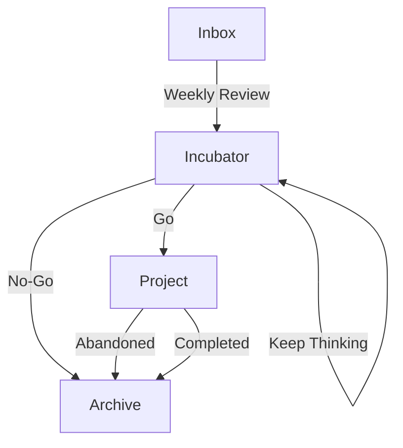

# 🧠 Brain-OS 

 
 


> **Brain-OS** is a personal, *local-first* system designed to **capture, incubate, and transform ideas into concrete projects over time**.

Built for developers who:

- constantly generate ideas
- want a **single source of truth**
- dislike fragmented tools (notes, docs, spreadsheets, etc.)
- need a system that **still makes sense months or years later**

---

## Table of Contents

* [Workflow Overview](#workflow-overview)
* [How to Use](#how-to-use)
  * [1. Capture a New Idea (Inbox)](#1-capture-a-new-idea-inbox)
  * [2. Weekly Idea Review (Inbox → Incubator)](#2-weekly-idea-review-inbox--incubator)
  * [3. Incubation Review (Incubator → Project)](#3-incubation-review-incubator--project)
  * [4. Project Execution](#4-project-execution)
* [Why This System Exists](#why-this-system-exists)
* [Philosophy](#philosophy)
* [Setup & Installation](#setup--installation)

---

## Architecture

Brain-OS is structured as a **production pipeline**, not just a notebook.

```text
/brain-os
├── 00_Inbox/          # Raw capture (no friction, no judgment)
├── 10_Incubator/      # Ideas being filtered and matured (the “Maybe” zone)
├── 20_Projects/       # Active development (Specs, MVP, Roadmaps)
├── 30_Archive/        # Abandoned or completed ideas (Post-mortems)
├── 99_Templates/      # Markdown templates for each stage
└── assets/            # Images and diagrams
```

---

## Workflow Overview



---

## How to Use

### 1. Capture a New Idea (Inbox)

Used for **fast, low-friction capture** whenever an idea appears
(commuting, shower thought, random insight).

**Steps:**

1. Open Obsidian
2. Create a new note (`Ctrl + N`)
3. Give it a short, descriptive title
4. Apply the `Tpl_Inbox` template (`Alt + T`)
5. Write just enough to avoid forgetting the idea

📌 **Rule:**
No judgment. No structuring. Just capture.

---

### 2. Weekly Idea Review (Inbox → Incubator)

Usually done **once a week**.

**Steps:**

1. Open the `00_Inbox` folder
2. Review each idea
3. Move relevant ones to `10_Incubator`
4. Open each moved note
5. Apply the `Tpl_Incubator` template (`Alt + N`)
6. Fill in the sanity check honestly

**Outcome:**

* ❌ Weak or irrelevant ideas → `30_Archive`
* 🌱 Promising ideas → remain in `10_Incubator`

📌 **Goal:**
Decide which ideas deserve time.

---

### 3. Incubation Review (Incubator → Project)

Ideas in the incubator are revisited over time
(days or weeks).

**Steps:**

1. Open `10_Incubator`
2. Re-read the concept and its evolution
3. Update the journal and sanity check
4. Decide to:

   * Archive the idea
   * Keep incubating
   * Promote it to a project

Promoted ideas are moved to `20_Projects`
and switched to the `Tpl_Project` template.

📌 **Rule:**
Only ideas that **survive time** become projects.

---

### 4. Project Execution

Projects represent **commitment**, not experiments.

**Steps:**

1. Define a strict MVP
2. Create a GitHub repository
3. Link the repository in the project note
4. Track decisions and progress in the dev journal

If a project is abandoned, move it to `30_Archive`
with a short post-mortem.

---

## Why This System Exists

* Ideas are never lost
* Decisions are explicit and documented
* Each idea has history and context
* Returning after 6 months still makes sense
* Git provides a timeline of your thinking

> Brain-OS is not about doing more projects.
> It is about **choosing better ones**.

---

## Philosophy

* Local-first
* Text over tools
* Simplicity over automation
* Time is a filter

---

## Setup & Installation

Brain-OS is fully local and requires **no backend**.
Only **Git** and **Obsidian** are needed.

### 1. Clone the repository

```bash
git clone git@github.com:YOUR_USERNAME/Brain-OS.git
cd Brain-OS
```

### 2. Open as an Obsidian Vault

* Open Obsidian
* Select **“Open folder as vault”**
* Choose the `Brain-OS` directory

### 3. Required Obsidian Configuration

Enable the following core plugin:

* **Templates**

**Settings:**

* **Files & Links**

  * Default location for new notes: `00_Inbox`
  * Attachment folder path: `assets`

* **Templates**

  * Template folder location: `99_Templates`
  * Date format: `YYYY-MM-DD`

### 4. Recommended Hotkeys (for speed)

* `Alt + T` → Insert Template
* `Alt + M` → Move file to another folder

### 5. Git sync (cross-platform)

To keep Brain-OS portable across desktop and mobile, prefer **Obsidian-compatible Git sync**.

* **Desktop:** Obsidian Git plugin
* **Mobile:** any Git-based Obsidian-compatible workflow you already trust

References:

* Obsidian community plugins: https://obsidian.md/plugins
* Obsidian Git plugin (community): https://github.com/denolehov/obsidian-git
